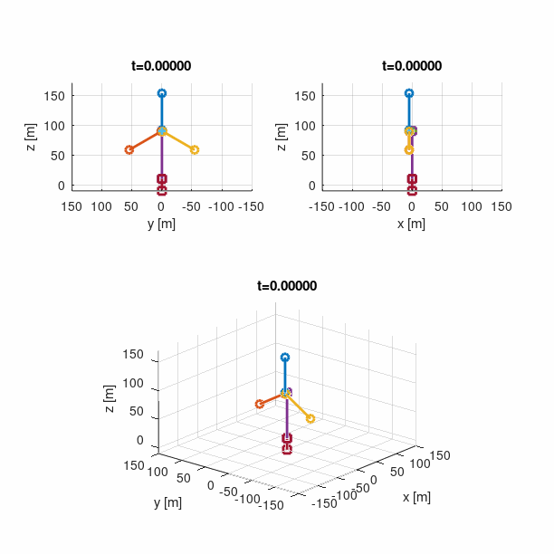
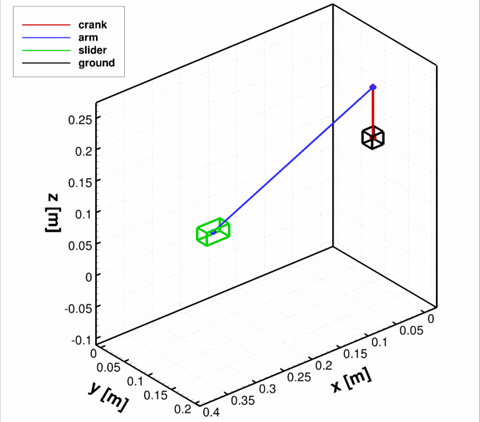
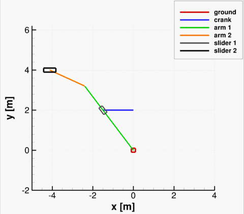

# MBDM: Multi-Body Dynamics Module

MBDM is a set of MATLAB functions that can be used to construct and solve a multi-body problem of general complexity. The assumptions of the code are that bodies are rigid, and joints are frictionless. More about the code and its usage can be found on https://www.windflow.pl/project/MBD  

## Documentation

Documentation is in form of [compiled pdf file](./DOCS/TN_MBDM.pdf).
It covers definition of bodies and joints, and basic derivation of all equations. 

## Examples

### Wind Turbine

### Slider-Crank 3D

### Quick-Return Mechanism 2D

## Note

Although the code is usable, it is rather a proof of concept. More sophisticated and way faster version was written in C.
